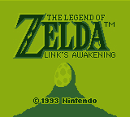
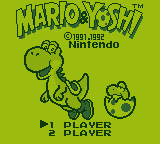

## DreamBoy - A [Nintendo GameBoy](https://en.wikipedia.org/wiki/Game_Boy) Emulator written in C++

DreamBoy is a work in-progress [Nintendo GameBoy](https://en.wikipedia.org/wiki/Game_Boy) Emulator. Its aim is to offer high compatibility and good performance. 

This project is a "next step" project for me, after writing several [Chip8](https://en.wikipedia.org/wiki/CHIP-8) Emulators.

#### Screenshots:

  
   
   
   

#### Status:

Blarggs Cpu Instruction Tests:

|#|name|state|
|-|-|-|
|01|special|:white_check_mark:|
|02|interrupts|:white_check_mark:|
|03|op sp,hl|:white_check_mark:|
|04|op r,imm|:white_check_mark:|
|05|op rp|:white_check_mark:|
|06|ld r,r|:white_check_mark:|
|07|jr,jp,call,ret,rst|:white_check_mark:|
|08|misc instrs|:white_check_mark:|
|09|op r,r|:white_check_mark:|
|10|bit ops|:white_check_mark:|
|11|op a,(hl)|:white_check_mark:|

Blarggs Misc Instruction Tests:

|#|name|state|
|-|-|-|
|01|cb Sound|:x:|
|02|dmg Sound|:x:|
|03|halt bug|:white_check_mark:|
|04|instruction timing|:x:|
|05|interrupt timing|:x:|
|06|mem timing|:x:|
|07|mem timing 2|:x:|
|08|oam bug|:x:|

Mooneye's General tests:

|#|name|state|
|-|-|-|
|01|opus 5|:white_check_mark:|

Mooneye's Emulator-Only MBC1 Tests:

|#|name|state|
|-|-|-|
|01|bits ram|:white_check_mark:|
|02|multicart rom 8Mb|:x:|
|03|ram 64Kb|:white_check_mark:|
|04|ram 256Kb|:white_check_mark:|
|05|rom 512Kb|:white_check_mark:|
|06|rom 1Mb|:white_check_mark:|
|07|rom 2Mb|:white_check_mark:|
|08|rom 4Mb|:white_check_mark:|
|09|rom 8Mb|:x:|
|10|rom 16Mb|:x:|

Mooneye's Acceptance Tests:

|#|name|state|
|-|-|-|
|01|boot hwio dmg0|:x:|
|02|boot hwio dmg ABCXmgb|:x:|
|03|boot hwio S|:x:|
|04|boot regs dmg0|:x:|
|05|boot regs dmgABCX|:x:|
|06|add sp_e timing|:x:|
|07|call cc timing|:x:|
|08|call cc timing 2|:x:|
|09|call timing|:x:|
|10|call timing 2|:x:|
|11|di timing GS|:x:|
|12|div timing|:x:|
|13|ei sequence|:x:|
|14|ei timing|:x:|
|15|halt ime0 ei|:white_check_mark:|
|16|halt ime0 nointr timing|:x:|
|17|halt ime1 timing|:x:|
|18|halt ime1 timing2 GS|:x:|
|19|if ie registers|:x:|
|20|intr timing|:x:|
|21|jp cc timing|:x:|
|22|jp timing|:x:|
|23|ld hl_sp_e timing|:x:|
|24|oam dma restart|:x:|
|25|oam dma start|:x:|
|26|oam dma timing|:x:|
|27|pop timing|:x:|
|28|push timing|:x:|
|29|rapid di ei|:x:|
|30|ret cc timing|:x:|
|31|ret timing|:x:|
|32|reti intr timing|:x:|
|33|reti timing|:x:|
|34|rst timing|:x:|

Mooneye's Acceptance Bit Tests:

|#|name|state|
|-|-|-|
|01|mem_oam|:white_check_mark:|
|02|reg f|:x:|
|03|unused_hwio-GS|:x:|

#### Technology Used:

DreamBoy uses [C++ 11](https://en.wikipedia.org/wiki/C%2B%2B11) and [SDL 2](https://www.libsdl.org/download-2.0.php) with OpenGL for drawing the GameBoy Lcd.

#### Supported Operating Systems:

Linux, Windows & Mac OS.

#### Sources:

- [GameBoy CPU Manual](http://www.codeslinger.co.uk/pages/projects/gameboy/files/GB.pdf)
- [CodeSlinger](http://www.codeslinger.co.uk/pages/projects/gameboy/beginning.html)
- [Gameboy Opcodes](http://pastraiser.com/cpu/gameboy/gameboy_opcodes.html)
- [Pandocs](http://bgb.bircd.org/pandocs.htm)
- [Imran Nazar](http://imrannazar.com/GameBoy-Emulation-in-JavaScript:-Memory)
- [Devrs](http://www.devrs.com/gb/files/opcodes.html)