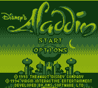
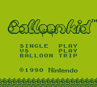
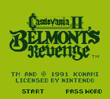
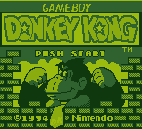
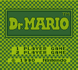
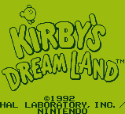
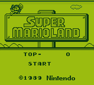
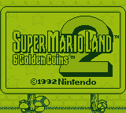
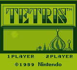

## DreamBoy - A [Nintendo GameBoy](https://en.wikipedia.org/wiki/Game_Boy) Emulator written in C++

DreamBoy is a work in-progress [Nintendo GameBoy](https://en.wikipedia.org/wiki/Game_Boy) Emulator. Its aim is to offer high compatibility and good performance. 

This project is a "next step" project for me, after writing several [Chip8](https://en.wikipedia.org/wiki/CHIP-8) Emulators.

#### Screenshots:

  
   
   

#### Status:

Blarggs Cpu Instruction tests:

|#|name|state|
|-|-|-|
|01|special|:white_check_mark:|
|02|interrupts|:white_check_mark:|
|03|op sp,hl|:white_check_mark:|
|04|op r,imm|:white_check_mark:|
|05|op rp|:white_check_mark:|
|06|ld r,r|:white_check_mark:|
|07|jr,jp,call,ret,rst|:white_check_mark:|
|08|misc instrs|:white_check_mark:|
|09|op r,r|:white_check_mark:|
|10|bit ops|:white_check_mark:|
|11|op a,(hl)|:white_check_mark:|

#### Technology Used:

DreamBoy uses [C++ 11](https://en.wikipedia.org/wiki/C%2B%2B11) and [SDL 2](https://www.libsdl.org/download-2.0.php) with OpenGL for drawing the GameBoy Lcd.

#### Supported Operating Systems:

Linux, Windows & Mac OS.

#### Sources:

- [GameBoy CPU Manual](http://www.codeslinger.co.uk/pages/projects/gameboy/files/GB.pdf)
- [CodeSlinger](http://www.codeslinger.co.uk/pages/projects/gameboy/beginning.html)
- [Gameboy Opcodes](http://pastraiser.com/cpu/gameboy/gameboy_opcodes.html)
- [Pandocs](http://bgb.bircd.org/pandocs.htm)
- [Imran Nazar](http://imrannazar.com/GameBoy-Emulation-in-JavaScript:-Memory)
- [Devrs](http://www.devrs.com/gb/files/opcodes.html)